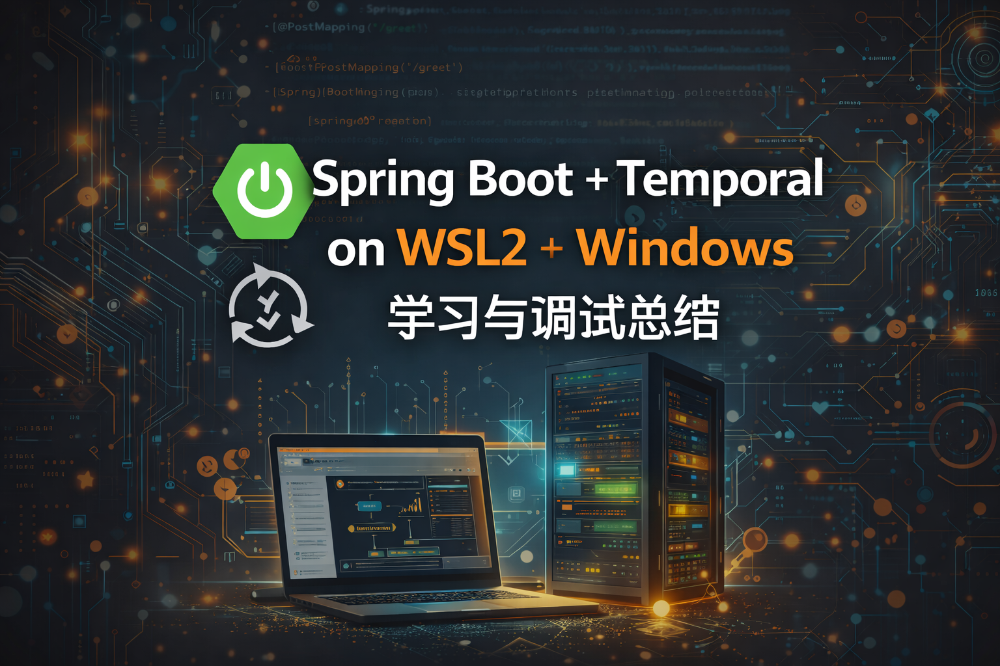

---

学习springboot + Temporal构建Agent工作流，第一步写个小demo验证一下环境连通性

---

<!-- truncate -->

## 一、学习目标与整体环境

### 学习目标

* 在本地完整跑通 **Temporal + Spring Boot**
* 理解 Temporal 的 **Worker / Workflow / Activity** 基本模型
* 在 **WSL2 + Windows 混合环境** 下解决真实网络与调试问题
* 获得一套可复用的最小可运行 Demo 与排障经验

### 实际环境

* 操作系统：Windows 11
* 子系统：WSL2（Arch Linux）
* Shell：fish
* Java：Java 25
* 构建工具：Gradle（9.3.0）
* Temporal Server：运行在 WSL 中（CLI dev server）
* Spring Boot (3.5.10)：运行在 Windows 宿主机

---

## 二、安装 Temporal CLI（WSL2 / Arch）

### 1. 使用官方推荐安装方式

在 **WSL（Arch）** 中执行：

```bash
curl -sSf https://temporal.download/cli.sh | bash
```

默认会安装到：

```
~/.temporalio/bin/temporal
```

### 2. 配置 PATH（fish shell）

```fish
set -U fish_user_paths $HOME/.temporalio/bin $fish_user_paths
```

验证：

```bash
temporal --version
```

能正确输出版本号，说明 CLI 安装成功。

---

## 三、启动 Temporal Dev Server（学习模式）

### 1. 启动 server

```bash
temporal server start-dev
```

该命令会：

* 启动一个本地 Temporal Server（Frontend / History / Matching 合体）
* 默认监听 `127.0.0.1:7233`
* 自动创建 `default` namespace
* 适合学习与本地开发（非生产）

### 2. 验证 server 状态

```bash
temporal operator cluster health
```

返回：

```
SERVING
```

说明 Temporal Server 已正常对外提供服务。

---

## 四、最小 Spring Boot + Temporal Worker Demo

### 1. 依赖与技术选型

* Spring Boot：3.5.10
* Gradle：9.3.0
* Temporal Starter：

  ```gradle
  implementation "io.temporal:temporal-spring-boot-starter:1.32.1"
  ```

### 2. application.yml 关键配置

```yaml
spring:
  application:
    name: demo

spring.temporal:
  namespace: default
  connection:
    target: 127.0.0.1:7233

  workers:
    - task-queue: greeting-task-queue
      workflow-classes:
        - org.ai.demo.GreetingWorkflowImpl
      activity-beans:
        - greetingActivityImpl
```

**关键点：**

* 配置前缀必须是 `spring.temporal`（不是 `temporal`）
* Worker 的 `task-queue` 必须与 Client 完全一致

---

## 五、Workflow / Activity 的正确写法（关键坑）

### 错误做法（会直接启动失败）

```java
// ❌ 在构造器或字段初始化中调用
Workflow.newActivityStub(...)
```

会抛出：

```
Called from non workflow or workflow callback thread
```

### 正确做法（必须遵守）

```java
@Override
public String greet(String name) {
    GreetingActivity activity =
        Workflow.newActivityStub(
            GreetingActivity.class,
            ActivityOptions.newBuilder()
                .setStartToCloseTimeout(Duration.ofSeconds(10))
                .build()
        );
    return activity.compose(name);
}
```

**核心原则：**

> 所有 `Workflow.*` API 只能在 Workflow 执行线程中调用
> 不能在 Spring Bean 初始化阶段调用

---

## 六、REST API 触发 Workflow（同步验证）

```java
@PostMapping("/greet")
public String greet(@RequestParam String name) {
    GreetingWorkflow workflow =
        client.newWorkflowStub(
            GreetingWorkflow.class,
            WorkflowOptions.newBuilder()
                .setTaskQueue("greeting-task-queue")
                .build()
        );
    return workflow.greet(name);
}
```

用于验证：

* WorkflowClient 注入是否成功
* Worker 是否在 poll task queue
* Workflow / Activity 是否真正执行

---

## 七、WSL2 ↔ Windows 网络调试全过程总结

### 1. 问题现象

* Spring Boot 在 Windows 上监听 `0.0.0.0:8080`
* WSL 中执行：

  ```bash
  curl http://localhost:8080
  ```

  **连接失败**

### 2. 关键认知（非常重要）

* WSL2 是 **独立虚拟机**
* `localhost` 在 WSL ≠ `localhost` 在 Windows
* WSL → Windows 必须使用 **Windows 在 WSL NAT 网络中的 IP**

---

### 3. 错误但常见的尝试

```bash
awk '/nameserver/ {print $2}' /etc/resolv.conf
```

得到的 IP（如 `xx.xxx.xx.xx`）：

* 不一定能访问 Windows 用户态服务
* 在本环境中 **连接被拒绝**

---

### 4. 正确、稳定的解决方案（fish shell）

#### 获取 Windows 宿主机 IP（推荐方式）

```fish
set WIN_HOST (ip route | awk '/default/ {print $3; exit}')
```

示例输出：

```
172.25.112.1
```

#### 通过该 IP 访问 Spring Boot

```fish
curl -v -X POST "http://$WIN_HOST:8080/api/greet?name=Alex"
```

成功返回：

```
HTTP/1.1 200
Hello Alex @2026-01-27T09:20:39.294459200Z
```

---

## 八、从成功结果可以确认的事实

通过这一条 `curl` 成功返回，可以**确定以下全部成立**：

1. WSL → Windows 网络链路已打通
2. Spring Boot 服务可被外部访问
3. Controller 正常工作
4. WorkflowClient 已成功连接 Temporal Server
5. Worker 正在 poll task queue
6. Workflow → Activity → 返回结果 全流程跑通

这是一次 **真实的 Temporal Workflow 执行**，不是假成功。

---

## 九、完整调用链回顾（一次成功请求）

```
WSL curl
  ↓
Windows Spring Boot (/api/greet)
  ↓
WorkflowClient
  ↓
Temporal Server (WSL, 7233)
  ↓
Worker poll task queue
  ↓
Workflow 执行
  ↓
Activity 执行
  ↓
结果返回
```

---

## 十、推荐的固定开发习惯（WSL2 + fish）

```fish
# 获取 Windows 宿主机 IP（最稳）
set WIN_HOST (ip route | awk '/default/ {print $3; exit}')

# 调用 Windows 上的服务
curl http://$WIN_HOST:8080
```

避免依赖：

* `localhost`
* `/etc/resolv.conf` 的 nameserver
* PowerShell 的 curl 别名


