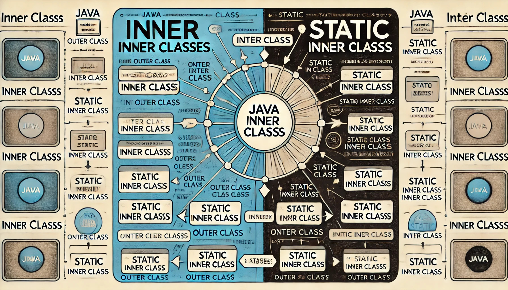

在Java编程中，***内部类***和***静态内部类***是两个重要的概念。它们允许在一个类的内部定义另一个类，从而提高代码的可读性和组织性。本文将详细讲解内部类和静态内部类的概念、使用场景、底层实现以及它们之间的区别。

<!-- truncate -->

## 内部类
***内部类（Inner Class）*** 是定义在另一个类中的类。内部类可以访问包含它的外部类的成员，包括私有成员。

### 定义和使用
***内部类***可以直接访问外部类的所有成员变量和方法。以下是一个简单的内部类示例：

```java
public class OuterClass {
    private String outerField = "Outer Field";

    public class InnerClass {
        public void display() {
            System.out.println("Outer Field: " + outerField);
        }
    }

    public static void main(String[] args) {
        OuterClass outer = new OuterClass();
        OuterClass.InnerClass inner = outer.new InnerClass();
        inner.display();
    }
}
```

在上述示例中，`InnerClass` 是 `OuterClass` 的内部类，它可以直接访问 `OuterClass` 的私有成员 `outerField`。

### 特性
1. **访问外部类成员**：内部类可以无条件地访问外部类的所有成员。
2. **与外部类实例相关联**：内部类的实例始终与外部类的实例相关联。
3. **封装性**：内部类提供了一种更好的封装机制，可以将一些仅在外部类中使用的类隐藏起来，避免被外部访问。

### 内部类的类型
Java中有四种类型的内部类：
1. **成员内部类**：定义在外部类的成员位置，不使用 `static` 修饰。
2. **局部内部类**：定义在方法或作用域内部。
3. **匿名内部类**：没有类名的内部类，通常在方法内部定义，用于简化代码。
4. **静态内部类**：使用 `static` 修饰的内部类。

#### 成员内部类
成员内部类是最常见的内部类，它定义在外部类的成员位置，不使用 `static` 修饰。

```java
public class OuterClass {
    private String outerField = "Outer Field";

    public class MemberInnerClass {
        public void display() {
            System.out.println("Outer Field: " + outerField);
        }
    }

    public static void main(String[] args) {
        OuterClass outer = new OuterClass();
        OuterClass.MemberInnerClass inner = outer.new MemberInnerClass();
        inner.display();
    }
}
```

#### 局部内部类
局部内部类定义在方法或作用域内部，只有在该方法或作用域内可见。

```java
public class OuterClass {
    public void methodWithInnerClass() {
        class LocalInnerClass {
            public void display() {
                System.out.println("Inside Local Inner Class");
            }
        }
        LocalInnerClass localInner = new LocalInnerClass();
        localInner.display();
    }

    public static void main(String[] args) {
        OuterClass outer = new OuterClass();
        outer.methodWithInnerClass();
    }
}
```

#### 匿名内部类
匿名内部类没有类名，通常在方法内部定义，用于简化代码。

```java
public class OuterClass {
    public void methodWithAnonymousClass() {
        Runnable runnable = new Runnable() {
            @Override
            public void run() {
                System.out.println("Inside Anonymous Inner Class");
            }
        };
        runnable.run();
    }

    public static void main(String[] args) {
        OuterClass outer = new OuterClass();
        outer.methodWithAnonymousClass();
    }
}
```

#### 静态内部类
静态内部类使用 `static` 修饰，不依赖于外部类的实例，可以直接创建其对象。

```java
public class OuterClass {
    private static String outerStaticField = "Outer Static Field";

    public static class StaticInnerClass {
        public void display() {
            System.out.println("Outer Static Field: " + outerStaticField);
        }
    }

    public static void main(String[] args) {
        OuterClass.StaticInnerClass inner = new OuterClass.StaticInnerClass();
        inner.display();
    }
}
```

### 底层实现
内部类在编译时会生成一个单独的字节码文件，其命名方式通常是 `OuterClassName$InnerClassName.class`。编译器在内部类的构造函数中会自动传入一个外部类的引用，用于访问外部类的成员。这可以通过反编译字节码文件来验证。

```java
public class OuterClass {
    private String outerField = "Outer Field";

    public class InnerClass {
        public InnerClass() {
            // 自动生成对外部类的引用
            OuterClass.this = OuterClass.this;
        }

        public void display() {
            System.out.println("Outer Field: " + outerField);
        }
    }
}
```

## 静态内部类
静态内部类（Static Inner Class），也称为嵌套类（Nested Class），是使用 `static` 关键字修饰的内部类。静态内部类不依赖于外部类的实例，可以直接创建其对象。

### 定义和使用
静态内部类不能直接访问外部类的非静态成员，但可以通过创建外部类的实例来访问。以下是一个静态内部类的示例：

```java
public class OuterClass {
    private static String outerStaticField = "Outer Static Field";
    private String outerField = "Outer Field";

    public static class StaticInnerClass {
        public void display() {
            System.out.println("Outer Static Field: " + outerStaticField);
        }
    }

    public static void main(String[] args) {
        OuterClass.StaticInnerClass inner = new OuterClass.StaticInnerClass();
        inner.display();
    }
}
```

在上述示例中，`StaticInnerClass` 是 `OuterClass` 的静态内部类，它可以直接访问外部类的静态成员 `outerStaticField`。

### 特性
1. **与外部类实例无关**：静态内部类的实例与外部类的实例无关，可以直接创建静态内部类的对象。
2. **访问限制**：静态内部类不能直接访问外部类的非静态成员，只能访问外部类的静态成员。
3. **独立性**：静态内部类可以被外部类之外的类实例化，提供更高的独立性。

### 底层实现
静态内部类在编译时会生成一个单独的字节码文件，其命名方式通常是 `OuterClassName$StaticInnerClassName.class`。由于静态内部类不依赖于外部类的实例，所以其内部不包含对外部类实例的引用。

## 内部类与静态内部类的区别
1. **访问外部类成员**：
   - 内部类可以直接访问外部类的所有成员（包括私有成员）。
   - 静态内部类只能直接访问外部类的静态成员，不能访问非静态成员。

2. **实例化方式**：
   - 内部类的实例必须通过外部类的实例来创建。
   - 静态内部类的实例可以直接创建，而不需要外部类的实例。

3. **与外部类实例的关系**：
   - 内部类的实例与外部类的实例紧密相关。
   - 静态内部类的实例与外部类的实例无关。

4. **内存管理**：
   - 内部类由于持有外部类的引用，可能会导致外部类实例无法被垃圾回收，从而引发内存泄漏。
   - 静态内部类不持有外部类的引用，更有利于垃圾回收。

## 适用场景
- **内部类** 适用于需要访问外部类的成员，且需要与外部类的实例紧密相关的场景。
- **静态内部类** 适用于不需要访问外部类的非静态成员，且独立于外部类实例的场景。

## 总结
内部类和静态内部类在Java编程中都有其特定的使用场景和优势。理解它们的区别和适用场景，可以更好地组织代码，提高代码的可读性和可维护性。同时，了解它们的底层实现可以帮助开发者更好地优化代码，避免潜在的问题。
