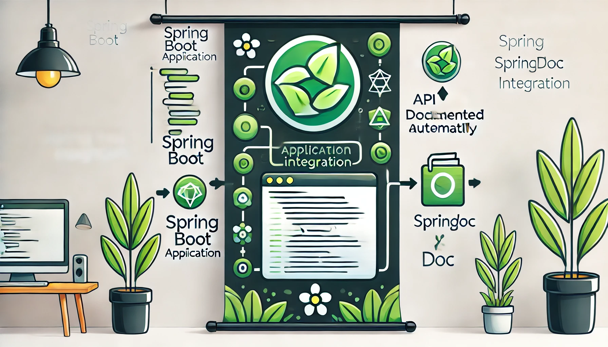

最近升级SpringBoot到了2.7.5,发现swagger不能愉快的使用了，网上查了一下发现2.6.6的时候就有问题了，去springfox的github看看，发现2020年就有人提出了issue，到现在都没有关闭。看了一下解决方案，都比较麻烦。计划使用springdoc替换springfox。

:::caution
这里用的是swagger3,注解和swagger2有些不同
:::

<!-- truncate -->


## 引入依赖

```grovvy
implementation 'org.springdoc:springdoc-openapi-ui:1.6.6'
```

:::danger
暂时不要用 `1.6.12`, 有bug导致swagger-ui访问报500
如果想使用1.6.x,就使用 `1.6.6`. 1.6.6以下的版本有访问swagger-ui会默认使用swagger的实例数据，手动在expolre输入 `/v3/api-docs` 才能看到项目的api数据的问题
:::

## 使用swagger-ui

引入依赖，直接就搞定了。 启动项目，访问 `http://IP:PORT/swagger-ui.html` 或者 `http://IP:PORT/swagger-ui/index.html`

## 配置springdoc

#### Global authorizations

默认的配置没有 全局的`authoriz` (就是swgger的authoriz的按钮)

```java
@Configuration  
public class SwaggerConfig {  
    @Bean  
    public OpenAPI openAPI() {  
        final String securityName = "Auth的名字";  // 
        return new OpenAPI()  
                .addSecurityItem(new SecurityRequirement().addList(securityName))  
                .components(  
                        new Components()  
                                .addSecuritySchemes(securityName,  
                                        new SecurityScheme()  
                                                .name(securityName)  
                                            .type(SecurityScheme.Type.APIKEY)  
                                                .in(SecurityScheme.In.HEADER)  
                                )  
                )  
                .info(new Info().title("标题").version("v1.0.0"));  
    }
}
```

:::info
`name` : header里面的参数名字
:::

#### 过滤swgger显示的API

默认配置直接启动，可能会看到一些不是我们写在项目中的API，有一些swagger的api，有一些openapi的api。对这些api进行一下过滤
配置 `application.yml`

```yaml
springdoc:  
  packages-to-scan: 包的引用名字  
  paths-to-match: /api/v1/**
```

