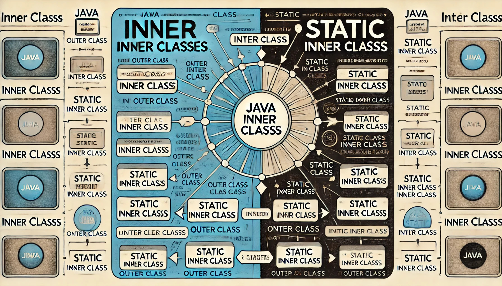

In Java programming, ***inner classes*** and ***static inner classes*** are two important concepts. They allow defining one class within another, thereby improving code readability and organization. This article will provide a detailed explanation of the concepts, use cases, underlying implementation, and differences between inner classes and static inner classes.

<!-- truncate -->

## Inner Classes

***Inner classes*** are classes defined within another class. ***Inner classes*** can access the members of the outer class, including private members.

### Definition and Usage

Inner classes can directly access all member variables and methods of the outer class. Below is a simple example of an inner class:

```java
public class OuterClass {
    private String outerField = "Outer Field";

    public class InnerClass {
        public void display() {
            System.out.println("Outer Field: " + outerField);
        }
    }

    public static void main(String[] args) {
        OuterClass outer = new OuterClass();
        OuterClass.InnerClass inner = outer.new InnerClass();
        inner.display();
    }
}
```

In the above example, `InnerClass` is an inner class of `OuterClass`, and it can directly access the private member `outerField` of `OuterClass`.

### Characteristics

1. **Access to Outer Class Members**: Inner classes can unconditionally access all members of the outer class.
2. **Associated with Outer Class Instance**: Instances of inner classes are always associated with an instance of the outer class.
3. **Encapsulation**: Inner classes provide better encapsulation, allowing some classes to be hidden and used only within the outer class, preventing external access.

### Types of Inner Classes

There are four types of inner classes in Java:
1. **Member Inner Classes**: Defined at the member level of the outer class without using the `static` keyword.
2. **Local Inner Classes**: Defined within a method or a scope.
3. **Anonymous Inner Classes**: Inner classes without a class name, usually defined within a method to simplify code.
4. **Static Inner Classes**: Inner classes defined with the `static` keyword.

#### Member Inner Classes

Member inner classes are the most common type of inner classes, defined at the member level of the outer class without using the `static` keyword.

```java
public class OuterClass {
    private String outerField = "Outer Field";

    public class MemberInnerClass {
        public void display() {
            System.out.println("Outer Field: " + outerField);
        }
    }

    public static void main(String[] args) {
        OuterClass outer = new OuterClass();
        OuterClass.MemberInnerClass inner = outer.new MemberInnerClass();
        inner.display();
    }
}
```

#### Local Inner Classes

Local inner classes are defined within a method or a scope and are only visible within that method or scope.

```java
public class OuterClass {
    public void methodWithInnerClass() {
        class LocalInnerClass {
            public void display() {
                System.out.println("Inside Local Inner Class");
            }
        }
        LocalInnerClass localInner = new LocalInnerClass();
        localInner.display();
    }

    public static void main(String[] args) {
        OuterClass outer = new OuterClass();
        outer.methodWithInnerClass();
    }
}
```

#### Anonymous Inner Classes

Anonymous inner classes have no class name and are usually defined within a method to simplify code.

```java
public class OuterClass {
    public void methodWithAnonymousClass() {
        Runnable runnable = new Runnable() {
            @Override
            public void run() {
                System.out.println("Inside Anonymous Inner Class");
            }
        };
        runnable.run();
    }

    public static void main(String[] args) {
        OuterClass outer = new OuterClass();
        outer.methodWithAnonymousClass();
    }
}
```

#### Static Inner Classes

Static inner classes are defined with the `static` keyword and do not depend on an instance of the outer class. They can be instantiated directly.

```java
public class OuterClass {
    private static String outerStaticField = "Outer Static Field";

    public static class StaticInnerClass {
        public void display() {
            System.out.println("Outer Static Field: " + outerStaticField);
        }
    }

    public static void main(String[] args) {
        OuterClass.StaticInnerClass inner = new OuterClass.StaticInnerClass();
        inner.display();
    }
}
```

### Underlying Implementation

Inner classes generate a separate bytecode file during compilation, usually named `OuterClassName$InnerClassName.class`. The compiler automatically passes a reference to the outer class in the constructor of the inner class to access the members of the outer class. This can be verified by decompiling the bytecode file.

```java
public class OuterClass {
    private String outerField = "Outer Field";

    public class InnerClass {
        public InnerClass() {
            // Automatically generated reference to the outer class
            OuterClass.this = OuterClass.this;
        }

        public void display() {
            System.out.println("Outer Field: " + outerField);
        }
    }
}
```

## Static Inner Classes

Static inner classes, also known as nested classes, are defined with the `static` keyword. Static inner classes do not depend on an instance of the outer class and can be instantiated directly.

### Definition and Usage

Static inner classes cannot directly access non-static members of the outer class but can access static members. Below is an example of a static inner class:

```java
public class OuterClass {
    private static String outerStaticField = "Outer Static Field";
    private String outerField = "Outer Field";

    public static class StaticInnerClass {
        public void display() {
            System.out.println("Outer Static Field: " + outerStaticField);
        }
    }

    public static void main(String[] args) {
        OuterClass.StaticInnerClass inner = new OuterClass.StaticInnerClass();
        inner.display();
    }
}
```

In the above example, `StaticInnerClass` is a static inner class of `OuterClass`, and it can directly access the static member `outerStaticField` of `OuterClass`.

### Characteristics

1. **Independent of Outer Class Instance**: Instances of static inner classes are independent of instances of the outer class and can be created directly.
2. **Access Restrictions**: Static inner classes cannot directly access non-static members of the outer class and can only access static members.
3. **Independence**: Static inner classes can be instantiated by classes outside the outer class, providing greater independence.

### Underlying Implementation

Static inner classes generate a separate bytecode file during compilation, usually named `OuterClassName$StaticInnerClassName.class`. Since static inner classes do not depend on instances of the outer class, they do not contain a reference to the outer class instance.

## Differences Between Inner Classes and Static Inner Classes

1. **Access to Outer Class Members**:

   - Inner classes can directly access all members (including private members) of the outer class.
   - Static inner classes can only directly access static members of the outer class and cannot access non-static members.

2. **Instantiation**:

   - Instances of inner classes must be created through an instance of the outer class.
   - Instances of static inner classes can be created directly without requiring an instance of the outer class.

3. **Relationship with Outer Class Instances**:

   - Instances of inner classes are closely related to instances of the outer class.
   - Instances of static inner classes are independent of instances of the outer class.

4. **Memory Management**:

   - Inner classes may hold a reference to the outer class, potentially preventing the outer class instance from being garbage collected, leading to memory leaks.
   - Static inner classes do not hold a reference to the outer class, making garbage collection more efficient.

## Use Cases

- **Inner Classes**: Suitable for scenarios where access to members of the outer class is needed, and a close association with instances of the outer class is required.

- **Static Inner Classes**: Suitable for scenarios where access to non-static members of the outer class is not needed, and independence from instances of the outer class is preferred.

## Conclusion

Inner classes and static inner classes each have their specific use cases and advantages in Java programming. Understanding their differences and appropriate use cases can help better organize code, improving readability and maintainability. Additionally, understanding their underlying implementation can help developers optimize code and avoid potential issues.