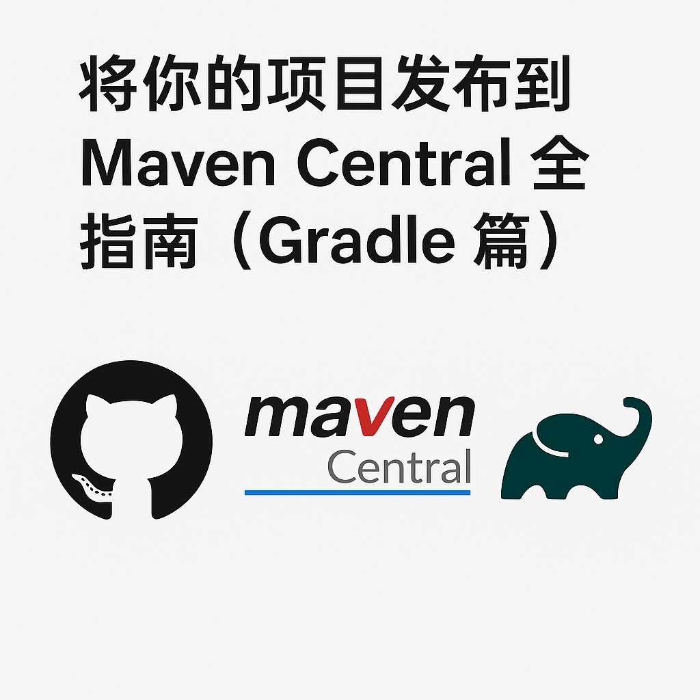

When we develop common utility classes or libraries in a project, we often want others to be able to reference and reuse these results directly.  
At this point, there are two main options:

- **Private Publishing**: Publish the dependency to a private Maven repository within your team or organization for internal sharing;  
- **Public Publishing**: Publish the dependency to a public repository on the Internet, such as [Maven Central](https://central.sonatype.com), so that developers worldwide can use your open-source library.

This article provides a detailed guide on how to publish your Gradle project to **Maven Central**.

<!-- truncate -->

## 🧰 Preparation

Before you begin publishing, you’ll need the following in addition to your existing project:

- A **GitHub account** (recommended)
- A **Maven Central account**
	- `User Token` (used for authentication)
	- `namespace` (corresponds to your `groupId`)
- A pair of **GPG keys** (used for signing)

:::tip  
Using a GitHub account to register with Maven Central is the most convenient approach. Maven Central will automatically create a `namespace` in the format `io.github.<GitHub username>` and verify it for you.
:::

---

## 🔐 Generate a User Token

Maven Central no longer uses a username and password. Instead, it authenticates using a **User Token**.

1. Log in to [Maven Central](https://central.sonatype.com)  
2. Click your username in the upper-left corner  
3. Select **View User Tokens**  
4. Click **Generate User Token**

:::caution
The token will only be shown once right after it is generated. Be sure to save it immediately. If you close the page, you won’t be able to view it again.
:::

---

## 🧭 Install GPG on Windows 11

:::tip 
If Git is already installed on your system, Git Bash comes with the `gpg` command, so you can skip this installation step.
:::

1. Go to the [Gpg4win official website](https://gpg4win.org/download.html) and download the installer.  
2. After installation, `gpg` will automatically be added to your PATH.  
3. Verify the installation by running:

```bash
gpg --version
````

If you see output similar to the following, the installation was successful:

```
gpg (GnuPG) 2.4.8
libgcrypt 1.11.1
...
```

---

## 📝 Create a GPG Key Pair

Maven Central requires that all published artifacts be signed with GPG. To generate a key pair:

```bash
gpg --full-generate-key
```

---

## 🌐 Publish Your GPG Public Key

Publishing your public key allows Maven Central and users to verify your signed files.

```bash
gpg --keyserver keyserver.ubuntu.com --send-keys <key id>
```

You can find your `key id` in the output line starting with `pub` after generating the key, for example:

```
pub   ed25519 2024-10-23 [SC]
      6CFB87829FC240EFA68E5F05E54502EB8D393E8C
```

Here, `6CFB87829FC240EFA68E5F05E54502EB8D393E8C` is the key ID.

Supported key servers include:

* `keyserver.ubuntu.com` ✅ (recommended)
* `keys.openpgp.org`
* `pgp.mit.edu`

---

## ⚙️ Configure `gradle.properties`

### Get the Short Key ID

Maven Central requires the **8-character short key ID**:

```bash
gpg --list-keys --keyid-format short
```

Example output:

```
pub   ed25519/8D393E8C 2024-10-23 [SC]
      6CFB87829FC240EFA68E5F05E54502EB8D393E8C
```

Here, `8D393E8C` is the short ID.

Add the configuration to your local `gradle.properties` file:

```properties
mavenCentralUsername=<user token name>
mavenCentralPassword=<user token>

signing.gnupg.keyName=<key id>
signing.gnupg.executable=gpg
signing.gnupg.passphrase=<password>
```

---

## 🚀 Configure the Gradle Publishing Plugin

Add the following to your `build.gradle.kts`:

```kotlin
plugins {
    signing
    id("com.vanniktech.maven.publish") version "0.30.0"
}
```

---

## 🌍 Configure Maven Central Publishing

```kotlin
mavenPublishing {
    publishToMavenCentral(SonatypeHost.CENTRAL_PORTAL)
    signAllPublications()
}
```

`SonatypeHost` options:

* `DEFAULT`: [https://oss.sonatype.org](https://oss.sonatype.org)
* `S01`: [https://s01.oss.sonatype.org](https://s01.oss.sonatype.org)
* `CENTRAL_PORTAL`: [https://central.sonatype.com](https://central.sonatype.com) ✅ (recommended)

---

## 🧾 Configure POM Metadata

Maven Central requires the POM file to include the following information:

* Project coordinates (group, name, version)
* Project name, description, and URL
* License information
* Developer information
* SCM (Source Control Management) information

Example configuration:

```kotlin
mavenPublishing {
    coordinates(project.group.toString(), project.name, project.version.toString())

    pom {
        name.set("${project.group}:${project.name}")
        description.set("This project provides runtime support libraries required by Codegen-gradle-plugin")
        url.set("<project web site>")

        licenses {
            license {
                name.set("The Apache License, Version 2.0")
                url.set("http://www.apache.org/licenses/LICENSE-2.0.txt")
            }
        }

        developers {
            developer {
                id.set("UserID")
                name.set("User name")
                email.set("example@mail.com")
            }
        }

        scm {
            url.set("<project web site>")
            connection.set("scm:git:git://github.com/<user name>/<project>")
            developerConnection.set("scm:git:ssh://git@github.com:<user name>/<project>.git")
        }
    }
}
```

---

## 📨 Publish to Maven Central

After completing the above steps, you can finally publish with one of the following commands:

```bash
./gradlew publish
```

or

```bash
./gradlew publishAllPublicationsToMavenCentralRepository
```

After the upload, log in to [Maven Central Publishing Portal](https://central.sonatype.com/publishing), find your project, click **Publish**, and wait a few minutes. Once the status changes to **Published**, your artifact is available to the world.

---

## 🏁 Conclusion

Congratulations — you’ve completed the entire process from initial setup, GPG configuration, and Gradle plugin setup to successfully publishing your library!
Once published, developers worldwide can use your library with a simple dependency line:

```kotlin
implementation("io.github.<your-username>:your-artifact:<version>")
```

This not only helps your project reach more users but also boosts your visibility in the open-source community.
In the future, you can integrate GitHub Actions to enable **automated publishing**, further improving your development workflow 🚀