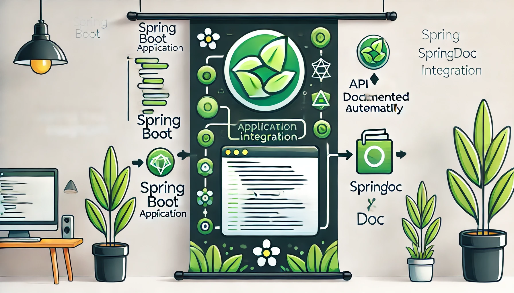

Recently upgraded SpringBoot to 2.7.5, found that swagger is not working well. After searching online, I found that the problem existed since version 2.6.6. Looking at springfox's GitHub, I saw that someone had raised an issue back in 2020, and it's still not closed. The solutions are quite cumbersome. I plan to replace springfox with springdoc.

:::caution
This uses swagger3, the annotations are somewhat different from swagger2.
:::

<!-- truncate -->

## Adding Dependencies

```groovy
implementation 'org.springdoc:springdoc-openapi-ui:1.6.6'
```

:::danger
Do not use `1.6.12` for now, it has a bug that causes swagger-ui to return 500. If you want to use 1.6.x, use `1.6.6`. Versions below 1.6.6 have an issue where accessing swagger-ui will default to using swagger instance data, and you need to manually enter `/v3/api-docs` in the explorer to see the project's API data.
:::

## Using swagger-ui

Simply add the dependency, and you're good to go. Start the project and visit `http://IP:PORT/swagger-ui.html` or `http://IP:PORT/swagger-ui/index.html`.

## Configuring springdoc

#### Global Authorizations

By default, there is no global `authoriz` (the authoriz button in swagger).

```java
@Configuration  
public class SwaggerConfig {  
    @Bean  
    public OpenAPI openAPI() {  
        final String securityName = "Auth Name";  
        return new OpenAPI()  
                .addSecurityItem(new SecurityRequirement().addList(securityName))  
                .components(  
                        new Components()  
                                .addSecuritySchemes(securityName,  
                                        new SecurityScheme()  
                                                .name(securityName)  
                                                .type(SecurityScheme.Type.APIKEY)  
                                                .in(SecurityScheme.In.HEADER)  
                                )  
                )  
                .info(new Info().title("Title").version("v1.0.0"));  
    }
}
```

:::info
`name`: the name of the parameter in the header
:::

#### Filtering swagger-displayed APIs

With the default configuration, you may see some APIs that are not written in the project, such as swagger APIs and openapi APIs. To filter these APIs, configure `application.yml`:

```yaml
springdoc:  
  packages-to-scan: package name  
  paths-to-match: /api/v1/**
```